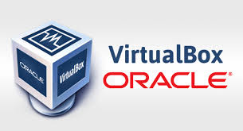
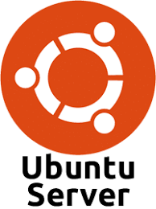
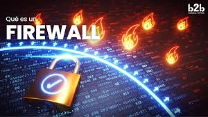

  | Name            |   Course       | Semester     | Professor     |
  | ----------------|----------------|--------------|---------------|  
  | Edison Moreno   |   CIS-106      | Spring 25    | R. Alberto    |

# Deliverable 1 Submission
---
## Basic Terminology
---
### What is a web server? Hardware and software side
- ***Hardware side:*** A web server's hardware refers to the physical machine or device that hosts the web server software. It includes components like CPU, memory (RAM), storage, and network interfaces, all of which work together to serve web content.
 
- ***Software side:*** The web server software (e.g., Apache, Nginx) is responsible for handling HTTP requests from clients (such as web browsers), processing them, and serving responses (like web pages).
### What are some different web server applications?

   |Logo                                             |Web server software |License             |Website                                    |
   |-------------------------------------------------|--------------------|--------------------|-------------------------------------------|
   |  |Apache HTTP Server  |Apache License 2.0  |[Apache](https://httpd.apache.org/)        | 
   |   |Inginx              |BSD                 |[Inginx](https://nginx.org/)               |
   |   |Lighttpd            |BSD License         |[Lighttpd](https://www.lighttpd.net)       |
   |   |LiteSpeed           |GPLv3               |[LiteSpeed](https://www.litespeedtech.com/)|
   |   |Caddy               |Apache License2.0   |[Caddy](https://caddyserver.com/)          | 

### What is virtualization?

***Virtualization*** is the creation of virtual (rather than physical) versions of resources, like servers, storage, or networks. It allows multiple virtual instances to run on a single physical machine, improving resource utilization and providing isolation. Common uses include creating virtual machines (VMs) and virtual networks.
### What is virtualbox?

***VirtualBox*** is an open-source virtualization software developed by Oracle that allows users to create and run multiple virtual machines on a single physical computer. It supports various operating systems, including Windows, Linux, and macOS, making it a popular tool for testing, development, and learning.
### What is a virtual machine?

***A virtual machine*** (VM) is a software-based simulation of a physical computer. It runs an operating system and applications just like a real computer but operates within a virtualized environment hosted on a physical machine (the host). Multiple VMs can run simultaneously on the same hardware.
### What is Ubuntu Server?

***Ubuntu Server*** is a version of the Ubuntu operating system optimized for server environments. Unlike the desktop version, it does not come with a graphical user interface (GUI), focusing instead on providing powerful server services (e.g., web hosting, databases, file sharing) via the command line.
### What is a firewall?

***A firewall*** is a security system that monitors and controls network traffic between different networks (such as between a private network and the internet). It can be hardware-based, software-based, or a combination, and it enforces rules to allow or block traffic based on security criteria, protecting systems from unauthorized access.
### What is SSH?

***SSH (Secure Shell)*** is a cryptographic network protocol used to securely access and manage remote systems over a network. It allows users to log into remote servers, execute commands, and transfer files securely. SSH encrypts the communication, ensuring that sensitive data remains protected.
