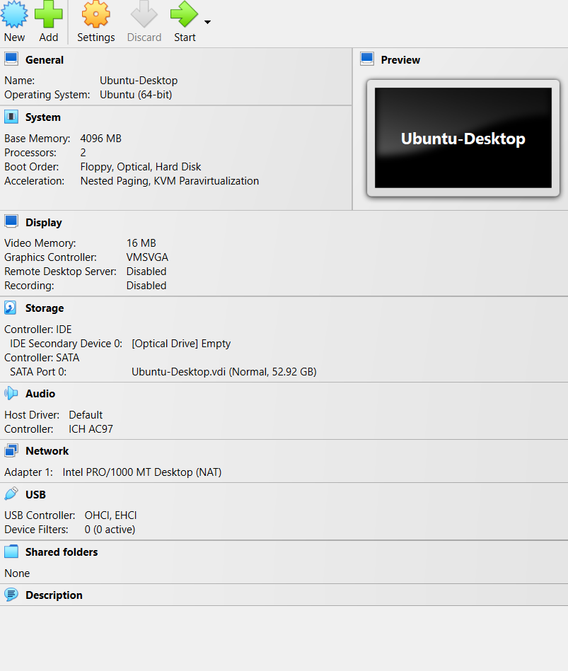
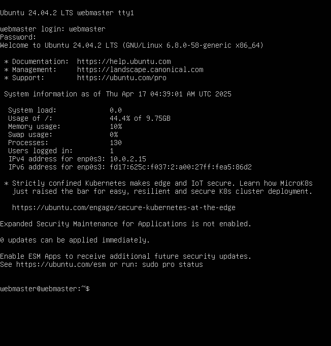

  | Name            |   Course       | Semester     | Professor     |
  | ----------------|----------------|--------------|---------------|  
  | Edison Moreno   |   CIS-106      | Spring 25    | R. Alberto    |

# Deliverable 2 Submission
---

## Questions

### 1.   What are the server hardware specifications (virtual machine settings)? Take a screenshot - don’t type it!
   
     

### 2.   What is Ubuntu server log in screen? Take screenshot - do not type it!
   
     

### 3.   What is the IP address of your Ubuntu Server Virtual Machine?
      
         The IP address is:  10.0.2.15

### 4.   How do you enable the Ubuntu Firewall?

         I can enable the Ubuntu Firewall with the following command:  
      
         sudo ufw enable

### 5.   How do you check if the Ubuntu Firewall is running?

         I can check the status of Apache to make sure it is running with the following command:  
      
         systemctl status --no-pager 

### 6.   How do you disable the Ubuntu Firewall?

         I can disable the ubuntu Firewall with the following command: 

         sudo ufw disable

### 7.   How do you add Apache to the Firewall?

         I can add Apache to the Firewall with the following command: 

         sudo ufw allow 'Apache'

### 8.   What is the command you used to install Apache?

         sudo apt update
         sudo apt install apache2 -y

### 9.   What is the command you use to check if Apache is running?

         sudo systemctl status apache2

### 10.  What is the command you use to stop Apache?

         sudo systemctl stop apache2 

### 11.  What is the command you use to restart Apache?

         sudo systemctl restart apache2

### 12.  What is the command used to test Apache configuration?

         sudo apache2ctl configtest

### 13.  What is the command used to check the installed version of Apache?

         apache2 -v

   |Logo                                             |Web server software |License             |Website                                    |
   |-------------------------------------------------|--------------------|--------------------|-------------------------------------------|
   |  |Apache HTTP Server  |Apache License 2.0  |[Apache](https://httpd.apache.org/)        | 
   |   |Inginx              |BSD                 |[Inginx](https://nginx.org/)               |
   |   |Lighttpd            |BSD License         |[Lighttpd](https://www.lighttpd.net)       |
   |   |LiteSpeed           |GPLv3               |[LiteSpeed](https://www.litespeedtech.com/)|
   |   |Caddy               |Apache License2.0   |[Caddy](https://caddyserver.com/)          | 

### What is virtualization?

