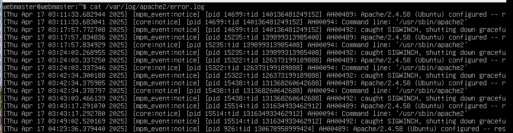
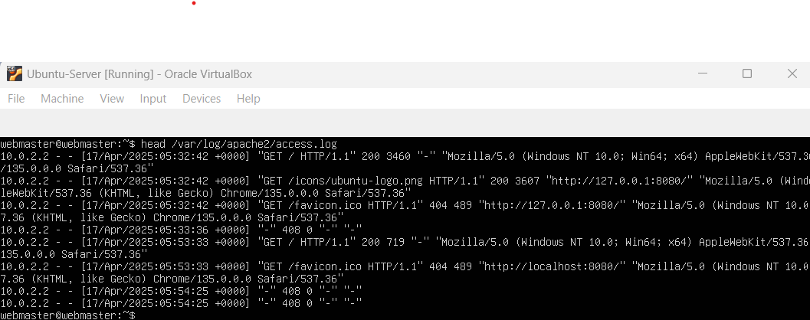
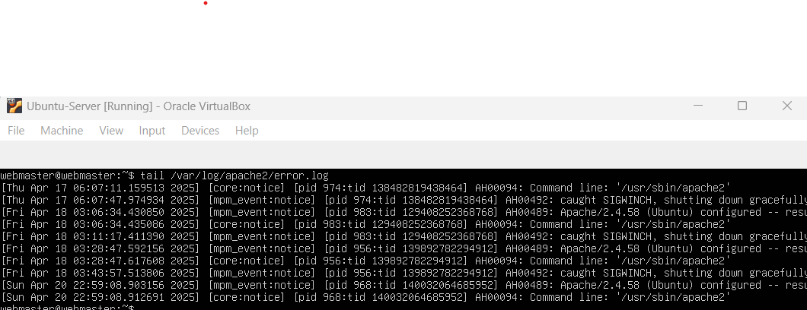

  |  Name           |  Course        |   Semester   |   Professor   |
  |-----------------|----------------|--------------|---------------|  
  |  Edison Moreno  |   CIS-106      | Spring 25    | R. Alberto    |

# Deliverable 2 Submission

## **Questions**

### 1.   What are the server hardware specifications (virtual machine settings)? Take a screenshot - don’t type it!
   
   

### 2.   What is Ubuntu server log in screen? Take screenshot - do not type it!
   
    

### 3.   What is the IP address of your Ubuntu Server Virtual Machine?
      
> The IP address is:  10.0.2.15

### 4.   How do you enable the Ubuntu Firewall?

> I can enable the Ubuntu Firewall with the following command:  sudo ufw enable

### 5.   How do you check if the Ubuntu Firewall is running?

> I can check the status of Apache to make sure it is running with the following command:  systemctl status --no-pager 

### 6.   How do you disable the Ubuntu Firewall?

> I can disable the ubuntu Firewall with the following command: sudo ufw disable

### 7.   How do you add Apache to the Firewall?

> I can add Apache to the Firewall with the following command: sudo ufw allow 'Apache'

### 8.   What is the command you used to install Apache?

> sudo apt update
> sudo apt install apache2 -y

### 9.   What is the command you use to check if Apache is running?

> sudo systemctl status apache2

### 10.  What is the command you use to stop Apache?

> sudo systemctl stop apache2 

### 11.  What is the command you use to restart Apache?

> sudo systemctl restart apache2

### 12.  What is the command used to test Apache configuration?

> sudo apache2ctl configtest

### 13.  What is the command used to check the installed version of Apache?

> apache2 -v

 

## How to Troubleshoot Common Apache Errors

### 1. What are the most common commands to troubleshoot Apache errors? Provide a brief description of each command.

|**Command**                   |**Description**     |
|------------------------------|--------------------|
|systemctl status apache2|Shows the current status of the Apache service. It helps check if Apache is active, failed, or stopped.|
|sudo journalctl -xe|Displays system logs, including Apache-related entries. Useful when apache2 fails to start.|
|sudo apachectl configtest|Tests the Apache configuration for syntax errors. If there are no issues, it returns Syntax OK.|
|sudo apachectl -t|Similar to configtest; it checks for syntax errors and displays the line/file if there are issues.|
|tail -f /var/log/apache2/error.log|Streams real-time Apache error logs. Helps track what's going wrong as it happens.|
|df -h and free -m|Shows available disk space and memory—important when services fail due to low system resources.|

 

### 2. Which are the common Apache Log Files, and what are they used for? Provide examples and screenshots of where they are located in you server, you can use any of he following commands: ***cat,head,tail***

|**Log File**           |**Location**                            |**Purpose**                                                                     |
|-----------------------|----------------------------------------|--------------------------------------------------------------------------------|
|access.log             | /var/log/apache2/access.log            | Stores all incoming requests: IP address, requested URL, HTTP status codes, browser used. Useful for traffic analysis.  |
|error.log              |/var/log/apache2/error.log              |Logs errors, failed requests, permission issues, module problems, etc. Critical for troubleshooting.   |
|other_vhost_access.log |/var/log/apache2/other_vhost_access.log |Logs access to virtual hosts (used when multiple websites are hosted on the same server).   |

 

### Examples and Screenshots

**cat /var/log/apache2/error.log** 

**head /var/log/apache2/access.log**

**tail /var/log/apache2/error.log**

