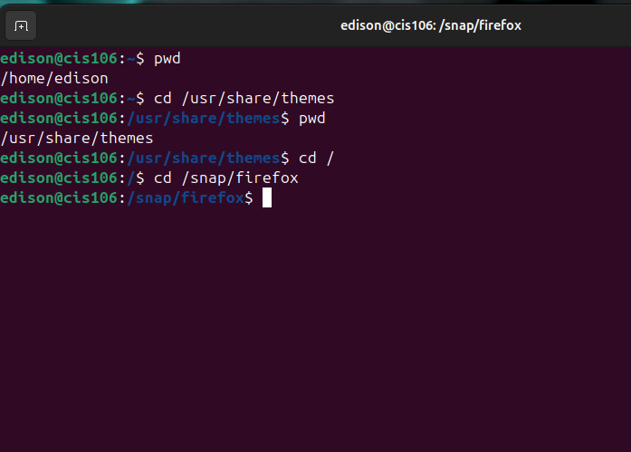
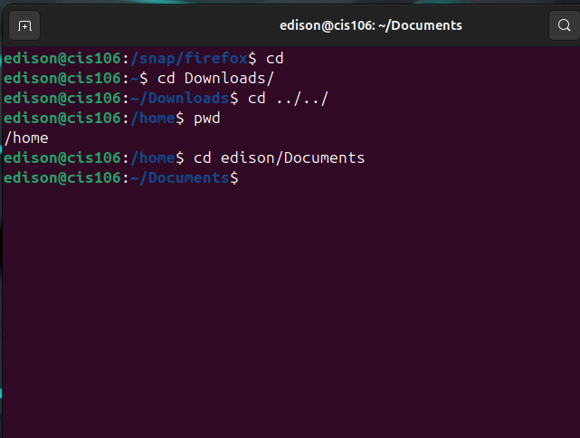
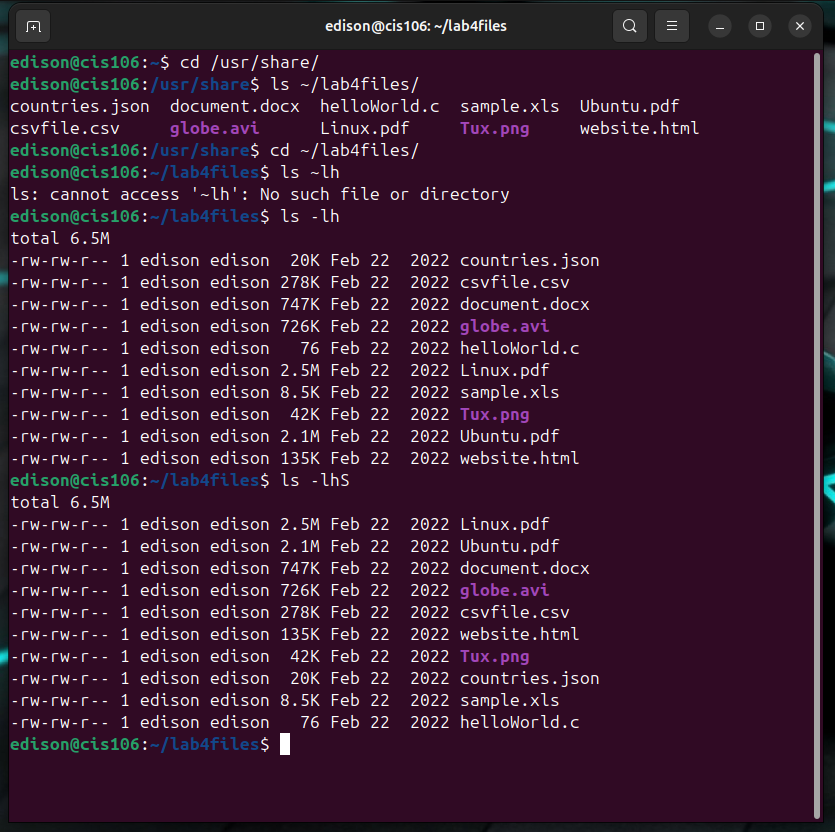
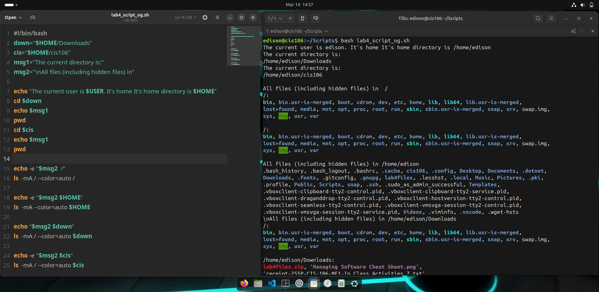

# Lab 4

## Question 1 (Absolute path and relative path Screenshots)

  

   

## Question 2 (ls Commando Screenshot)

## Question 3 (Shell Scripting Screenshot)

## Question 4 (Challenge question)

 

